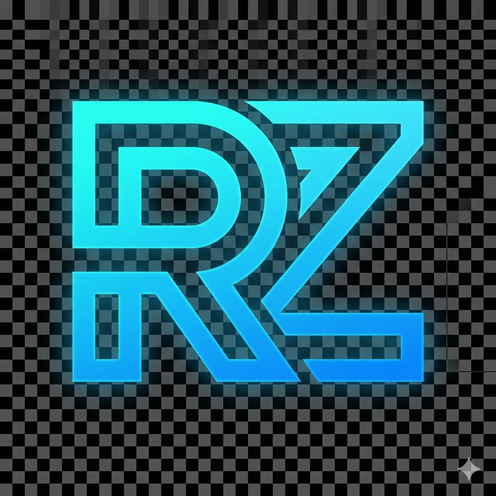

# 🚀 RZ Portfolio - Ryan Zinedine

<p align="center">
  
</p>

<p align="center">
  <strong>Desenvolvedor Front-end | HTML • CSS • JavaScript</strong>
</p>

<p align="center">
  <a href="https://portfolio.vercel.app/">Visualizar Projeto Online</a>
</p>

---

## 💻 Sobre o Projeto

Este é o meu portfólio pessoal, desenvolvido para centralizar meus projetos, habilidades e trajetória profissional. O design foi construído com uma estética **moderna e responsiva**, utilizando conceitos de UI/UX para garantir uma navegação fluida tanto em Desktop quanto em Mobile.

### ✨ Funcionalidades:
- **Preloader:** Tela de carregamento customizada.
- **Menu Hamburguer:** Navegação otimizada para dispositivos móveis.
- **Scroll Reveal:** Animações de entrada suaves ao rolar a página.
- **Efeitos Hover:** Destaque interativo nos cards de projetos e vídeos.
- **Dark Mode Native:** Paleta de cores focada em tons escuros com acentos neon (Azul e Roxo).

---

## 🛠️ Tecnologias Utilizadas

As principais ferramentas e linguagens utilizadas no desenvolvimento:

- **HTML5:** Estruturação semântica.
- **CSS3:** Estilização avançada com Variáveis, Flexbox e Media Queries.
- **JavaScript (Vanilla):** Manipulação de DOM para interatividade e animações.
- **Vercel:** Hosting e Deploy contínuo.

---

## 📸 Preview


---

## 🚀 Como rodar o projeto localmente

Se desejar testar o código em sua máquina:

1. Clone o repositório:
   ```bash
   git clone [https://github.com/RyanZine/portfolio.git](https://github.com/RyanZine/portfolio.git)