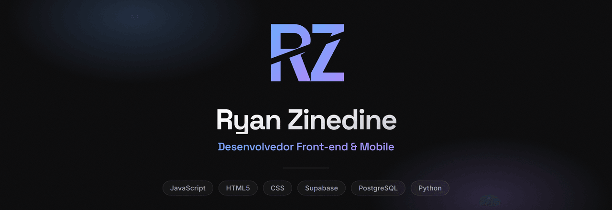

<p align="center">
  
</p>

<p align="center">
  <a href="https://portfolio-ryanzine.vercel.app/"><strong>portfolio-ryanzine.vercel.app</strong></a>
  &nbsp;·&nbsp;
  <a href="https://www.linkedin.com/in/ryan-zinedine-rodrigues-de-sousa-pereira-8b63b3314">LinkedIn</a>
  &nbsp;·&nbsp;
  <a href="mailto:zinedinepereira07@gmail.com">E-mail</a>
</p>

---

## Sobre

Meu portfólio pessoal: quem eu sou, o que já construí e como me encontrar.
Uma página só, escrita à mão em HTML, CSS e JavaScript — sem framework, sem
build, sem dependência para instalar. Publicada na Vercel.

## O que tem dentro

| Seção | Conteúdo |
| --- | --- |
| **Sobre** | Quem eu sou e a stack, num grid de cartões |
| **Experiência** | SmartRanch, na Mindloop — app Flutter para o agronegócio, com câmeras ao vivo (WebRTC/WHEP), tempo real e backend em Supabase |
| **Projetos** | Vila dos Estudos e Reset Mind em destaque; landing pages antigas agrupadas em "trabalhos anteriores" |
| **Trajeto** | Formação, cursos e marcos, do mais recente ao começo |
| **Contato** | E-mail e redes |

## Decisões técnicas

**Logo autoral em SVG.** Monograma RZ sólido com um corte diagonal atravessando
as duas letras, em degradê azul → violeta. O corte é a assinatura da marca: ele
se dissolve no tamanho de favicon e reaparece quando ela cresce. Favicon, ícone
de iOS e capa social saem todos do mesmo desenho.

**Tudo num sprite SVG.** Ícones de interface, marca e logotipos das tecnologias
([Simple Icons](https://simpleicons.org/), CC0) ficam num único `<svg>` com
`<symbol>`/`<use>` no topo do documento. Nenhuma requisição extra, nitidez em
qualquer tela e cor controlada pelo CSS.

**Cor como informação.** Cada tecnologia aparece na cor da própria marca; o que
não tem marca fica em cinza. As cores oficiais escuras demais para fundo preto
foram clareadas até passarem no contraste — todas acima de 4,5:1.

**150 KB de imagem, não 10 MB.** Os previews dos projetos são WebP capturados
dos sites publicados, entre 24 e 48 KB cada. A versão anterior usava GIFs que
somavam 10,5 MB.

**Animação de entrada só com o JS vivo.** A classe `.js` entra pelo script antes
de o CSS poder esconder qualquer coisa — se o arquivo não carregar, a página
aparece inteira em vez de ficar invisível.

**Vidro sem quebrar o menu.** `backdrop-filter` transforma o elemento em
containing block de qualquer filho `position: fixed`. Por isso a pílula do topo
é opaca no celular: com o blur ligado, o menu abria dentro dela.

**Movimento é opcional.** `prefers-reduced-motion` desliga transições, o brilho
que segue o cursor e a animação de entrada. O brilho também só existe onde há
mouse de verdade (`hover: hover`).

## Estrutura

```
index.html          página inteira, com o sprite de ícones
style.css           tokens, layout e responsividade
script.js           menu mobile, pílula do topo e entrada das seções
img/                logo, favicon, foto e capa social
img/projetos/       previews em WebP
```

## Rodando localmente

```bash
git clone https://github.com/RyanZine/Portfolio.git
cd Portfolio
```

Abrir o `index.html` no navegador já basta — não há build.

## Licença

Código sob [MIT](LICENSE). A logo, a foto e os textos são meus.
